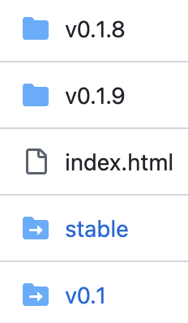

# DocumenterVitepress.jl
[](https://luxdl.github.io/DocumenterVitepress.jl/stable/)
[](https://luxdl.github.io/DocumenterVitepress.jl/dev/)
[](https://juliapkgstats.com/pkg/DocumenterVitepress)
[](https://juliapkgstats.com/pkg/DocumenterVitepress)
[](https://github.com/LuxDL/DocumenterVitepress.jl/actions/workflows/Documenter.yml)


This package provides a Markdown backend to [Documenter.jl](https://documenter.juliadocs.org/stable/).
The generated Markdown is rendered to HTML using the static site generator [vitepress](https://vitepress.dev/).

## Installation

The package can be added using the Julia package manager. From the Julia REPL, type `]` to enter the Pkg REPL mode and run

```shell
pkg> add DocumenterVitepress
```

## Usage

### Rendering

To enable the backend:
1. Add `DocumenterVitepress` to your `docs` environment using Pkg
2. Add `using DocumenterVitepress` in `docs/make.jl`,
3. Pass `format = DocumenterVitepress.MarkdownVitepress(...)` to `makedocs` like so, replacing e.g. `format = HTML(...)`:

```julia
using Documenter
using DocumenterVitepress

makedocs(;
    format = DocumenterVitepress.MarkdownVitepress(
        repo = "github.com/YourName/YourPackage.jl",
        devbranch = "main", # or master, trunk, ...
        devurl = "dev",
        # if you use something else than yourname.github.io/YourPackage.jl
        deploy_url = "yourdomain.org/docs/YourPackage",
    ),
)
```

Locally, the docs should now be rendered to `docs/build/1`.

> [!NOTE]
> Why `build/1`?
> 
> Since version 0.2, DocumenterVitepress renders a separate build for each base or sub-URL at which your site
> should be accessible. For example, the same version `v1.2.3` might need to be made available at `/v1.2.3`, `/v1.2`, `/v1` and `/stable`.
> The `vitepress` build process requires a separate build for each of these, which are stored in sequentially numbered
> folders `build/1`, `build/2` and so on. The bases related to these builds are stored in the sidecar file `bases.txt`.
> 
> When building locally, the only base rendered should always be the empty string `""` because a local build is neither a dev build, a version build
> or a PR preview build. Therefore, the locally rendered docs should always be found in `docs/build/1`.


### Viewing locally

To view the docs locally, you can serve the `docs/build/1` folder, for example using the `LiveServer` package:

```julia
using LiveServer

LiveServer.serve(dir = "docs/build/1")
```

### Deploying

Since version 0.2, DocumenterVitepress is not compatible with `Documenter.deploydocs` anymore because a single build can potentially
consist of multiple versions, like `/v1.2.3`, `/v1.2`, `/v1` and `/stable`.

Instead, use the separate function of the same name `DocumenterVitepress.deploydocs` which uses similar keywords, for example:

```julia
DocumenterVitepress.deploydocs(;
    repo = "github.com/YourName/YourPackage.jl",
    target = joinpath(@__DIR__, "build"),
    branch = "gh-pages",
    devbranch = "main", # or master, trunk, ...
    push_preview = true,
)
```

> [!CAUTION]  
> Deployment will fail if any of the subfolders on your gh-pages branch that should be written to are symlinks to other folders.
> For example, gh-pages might contain a `stable` symlink from earlier Documenter.jl deployments, but DocumenterVitepress wants
> to deploy to an actual folder called `stable`.
> 
> Due to peculiarities in the deploy process, DocumenterVitepress cannot currently fix this automatically, so you have to delete
> the offending symlink manually. On GitHub, you can simply go to https://github.com/YourName/YourPackage.jl/tree/gh-pages, click on
> the symlink and on the next page delete it through the context menu. In the following screenshot from an example `gh-pages` branch,
> the symlinks are `stable` and `v0.1` which can be recognized by the arrow symbol.
> 
> 


### Customizing Vitepress

If you wish to fully customize your documentation with all of the capabilities of [Vitepress](https://vitepress.dev), 
then you can use our template generator.  But be warned that you may have to update that template to keep pace with 
DocumenterVitepress changes!

> [!TIP]
> To get a fully customizable build, run 
> ```julia 
> DocumenterVitepress.generate_template("/path/to/YourPackage/docs", "YourPackage")
> ```
> to populate all of the files which Vitepress requires.

***

The documentation needs documentation.

-a Bellevue Linux Users Group member, 2005-
